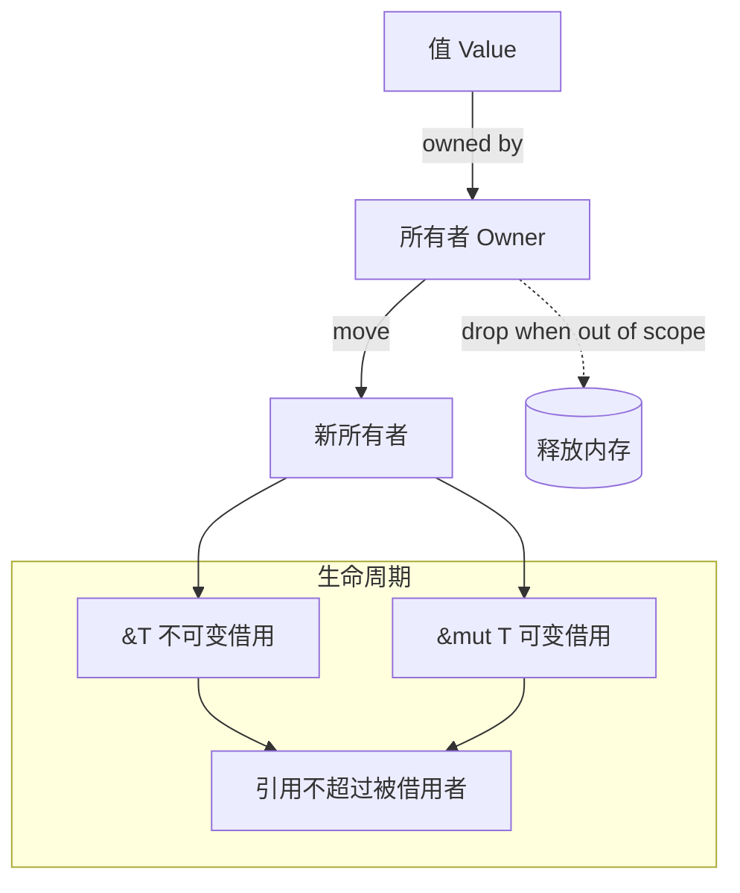
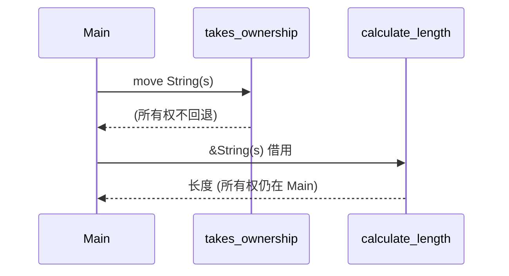

# 第二章：核心概念：所有权与生命周期

所有权是 Rust 最独特的功能，它使 Rust 能够在没有垃圾回收器的情况下保证内存安全。本章将深入探讨所有权、借用、切片和生命周期这些核心概念。

---

示意图：所有权/借用/生命周期关系



### 21. 什么是所有权 (Ownership)？

**答：**
所有权是 Rust 用来管理内存的一套规则。它解决了“谁拥有哪块内存？”以及“这块内存何时可以被释放？”这两个核心问题。所有权遵循三个基本规则：
1.  Rust 中的每一个值都有一个被称为其**所有者 (owner)** 的变量。
2.  值在任一时刻有且只有一个所有者。
3.  当所有者（变量）离开作用域时，这个值将被**丢弃 (dropped)**，其占用的内存会被释放。

---

### 22. 什么是栈 (Stack) 和堆 (Heap)？

**答：**
- **栈 (Stack):** 用于存储大小已知且固定的数据。它速度快，以“后进先出”的方式组织数据。函数调用、局部变量（如 `i32`, `bool`）通常存储在栈上。
- **堆 (Heap):** 用于存储在编译时大小未知或可能变化的数据。操作系统在堆的某处找到一块足够大的空位，把它标记为已使用，并返回一个表示该位置地址的**指针 (pointer)**。这个过程称为“在堆上分配内存”。它比访问栈要慢。`String`、`Vec<T>` 等类型的数据存储在堆上。

所有权系统主要就是为了管理堆内存。

---

### 23. 移动 (Move) 是什么意思？

**答：**
对于存储在堆上的数据（如 `String`），当我们将它赋值给另一个变量时，所有权会发生**转移 (transfer)**，我们称之为“移动 (move)”。

```rust
fn main() {
    let s1 = String::from("hello");
    println!("s1 创建后: {}", s1);
    
    let s2 = s1; // s1 的所有权被移动到 s2
    println!("移动后 s2: {}", s2);
    
    // println!("{}, world!", s1); // 编译错误！s1 不再有效
    
    // 如果想要复制而不是移动，可以使用 clone
    let s3 = String::from("world");
    let s4 = s3.clone(); // 深拷贝
    println!("s3: {}, s4: {}", s3, s4); // 两个都有效
    
    // 演示移动后的变量状态
    demonstrate_move();
}

fn demonstrate_move() {
    let original = String::from("I will be moved");
    let moved_to = take_ownership(original);
    
    // println!("{}", original); // 编译错误：original 已被移动
    println!("函数返回: {}", moved_to);
}

fn take_ownership(s: String) -> String {
    println!("函数内部: {}", s);
    s // 返回所有权
}
```
为了保证内存安全（防止二次释放），一旦所有权转移，原来的变量（`s1`）就不能再被使用。

---

### 24. 复制 (Copy) 是什么意思？

**答：**
对于完全存储在栈上的数据（如 `i32`, `bool`, `char` 等基本类型），当我们将它赋值给另一个变量时，会创建一个完整的副本。这被称为“复制 (copy)”。

```rust
fn main() {
    // 基本类型的复制
    let x = 5;
    let y = x; // x 的值被复制到 y
    println!("复制后: x = {}, y = {}", x, y); // 正确！x 和 y 都有效
    
    // 多种 Copy 类型示例
    let a = 42;
    let b = true;
    let c = 3.14;
    let d = 'R';
    
    let a2 = a; // 复制
    let b2 = b; // 复制
    let c2 = c; // 复制
    let d2 = d; // 复制
    
    println!("原始值仍然有效:");
    println!("a = {}, b = {}, c = {}, d = {}", a, b, c, d);
    println!("复制的值:");
    println!("a2 = {}, b2 = {}, c2 = {}, d2 = {}", a2, b2, c2, d2);
    
    // 元组的复制（如果所有元素都实现了 Copy）
    let tuple1 = (1, 2, 3);
    let tuple2 = tuple1; // 复制
    println!("tuple1: {:?}, tuple2: {:?}", tuple1, tuple2);
    
    // 数组的复制（如果元素实现了 Copy 且长度适中）
    let arr1 = [1, 2, 3, 4, 5];
    let arr2 = arr1; // 复制
    println!("arr1: {:?}, arr2: {:?}", arr1, arr2);
    
    demonstrate_copy_in_functions();
}

fn demonstrate_copy_in_functions() {
    let num = 100;
    let result = square(num);
    println!("原始值 {} 在函数调用后仍然有效", num);
    println!("平方结果: {}", result);
}

fn square(x: i32) -> i32 {
    x * x
}
```
如果一个类型实现了 `Copy` trait，那么它的变量在赋值时就不会被移动，而是被复制。

---

### 25. 函数如何获得值的所有权？

**答：**
将变量传递给函数与将其赋值给另一个变量类似。
- 对于实现了 `Copy` 的类型，值会被复制。
- 对于没有实现 `Copy` 的类型（如 `String`），所有权会被移动。

```rust
fn main() {
    // 所有权转移示例
    let s = String::from("hello");
    println!("调用函数前: {}", s);
    
    takes_ownership(s); // s 的所有权移动到函数里
    // println!("{}", s); // 编译错误！s 已失效

    // Copy 类型示例
    let x = 5;
    println!("调用函数前: {}", x);
    
    makes_copy(x); // x 的值被复制到函数里
    println!("调用函数后: {}", x); // 正确！x 仍然有效
    
    // 函数返回所有权
    let s1 = gives_ownership(); // 函数返回值的所有权转移给 s1
    println!("从函数获得: {}", s1);
    
    let s2 = String::from("world");
    let s3 = takes_and_gives_back(s2); // s2 移入函数，返回值移给 s3
    // println!("{}", s2); // 编译错误！s2 已失效
    println!("取回的值: {}", s3);
    
    // 演示多个变量的所有权转移
    demonstrate_multiple_ownership();
}

fn takes_ownership(some_string: String) {
    println!("函数接收到: {}", some_string);
} // some_string 在这里被 drop

fn makes_copy(some_integer: i32) {
    println!("函数接收到: {}", some_integer);
} // some_integer 在这里超出作用域，但因为是 Copy，没有特殊处理

fn gives_ownership() -> String {
    let some_string = String::from("函数创建的字符串");
    some_string // 返回 some_string，所有权移出函数
}

fn takes_and_gives_back(a_string: String) -> String {
    println!("函数处理: {}", a_string);
    a_string // 返回 a_string，所有权移出函数
}

fn demonstrate_multiple_ownership() {
    let s1 = String::from("first");
    let s2 = String::from("second");
    let s3 = String::from("third");
    
    let (s1, s2, s3, len) = calculate_lengths(s1, s2, s3);
    println!("返回的字符串: {}, {}, {}", s1, s2, s3);
    println!("总长度: {}", len);
}

fn calculate_lengths(s1: String, s2: String, s3: String) -> (String, String, String, usize) {
    let length = s1.len() + s2.len() + s3.len();
    (s1, s2, s3, length)
}
```
函数也可以返回值，从而将所有权交还给调用者。

---

### 26. 什么是借用 (Borrowing)？

**答：**
如果我们希望在不转移所有权的情况下让函数使用某个值，我们可以传递它的**引用 (reference)**。这个过程称为“借用”。引用使用 `&` 符号。

```rust
fn main() {
    // 基本借用示例
    let s1 = String::from("hello");
    let len = calculate_length(&s1); // 传递 s1 的引用
    println!("字符串 '{}' 的长度是 {}.", s1, len); // 正确！s1 仍然有效
    
    // 多次借用
    let s2 = String::from("world");
    let len1 = calculate_length(&s2);
    let len2 = calculate_length(&s2);
    let len3 = calculate_length(&s2);
    println!("字符串 '{}' 可以被多次借用: {}, {}, {}", s2, len1, len2, len3);
    
    // 不同类型的借用
    let numbers = vec![1, 2, 3, 4, 5];
    let sum = calculate_sum(&numbers);
    let count = count_elements(&numbers);
    println!("数组 {:?} 的和: {}, 元素个数: {}", numbers, sum, count);
    
    // 借用数组切片
    let arr = [1, 2, 3, 4, 5];
    let slice_sum = sum_slice(&arr[1..4]); // 借用切片
    println!("切片 {:?} 的和: {}", &arr[1..4], slice_sum);
    
    demonstrate_reference_rules();
}

fn calculate_length(s: &String) -> usize {
    s.len()
} // s 在这里超出作用域，但因为它不拥有引用值，所以不会 drop

fn calculate_sum(v: &Vec<i32>) -> i32 {
    let mut sum = 0;
    for item in v {
        sum += item;
    }
    sum
}

fn count_elements(v: &Vec<i32>) -> usize {
    v.len()
}

fn sum_slice(slice: &[i32]) -> i32 {
    slice.iter().sum()
}

fn demonstrate_reference_rules() {
    let s = String::from("reference rules");
    
    // 可以同时有多个不可变引用
    let r1 = &s;
    let r2 = &s;
    let r3 = &s;
    println!("多个不可变引用: {}, {}, {}", r1, r2, r3);
    
    // 引用的作用域
    {
        let r4 = &s;
        println!("作用域内的引用: {}", r4);
    } // r4 在这里超出作用域
    
    println!("原始字符串仍然有效: {}", s);
}
```
通过引用，`calculate_length` 函数“借用”了 `s1`，但并没有获得其所有权。

示意图：所有权传递与借用调用链



---

### 27. 不可变引用和可变引用有什么区别？

**答：**
- **不可变引用 (Immutable Reference):** `&T`。它允许你读取数据，但不能修改它。
- **可变引用 (Mutable Reference):** `&mut T`。它允许你修改借用的数据。

```rust
fn main() {
    // 可变借用示例
    let mut s = String::from("hello");
    println!("原始字符串: {}", s);
    
    {
        // 可变借用
        let r1 = &mut s;
        r1.push_str(", world");
        println!("可变借用修改后: {}", r1);
    } // r1 在这里超出作用域
    
    println!("修改后的原字符串: {}", s);
    
    // 演示借用规则
    demonstrate_borrowing_rules();
    
    // 可变引用的实际应用
    let mut numbers = vec![1, 2, 3];
    println!("修改前: {:?}", numbers);
    
    modify_vector(&mut numbers);
    println!("修改后: {:?}", numbers);
    
    // 通过可变引用交换值
    let mut a = 10;
    let mut b = 20;
    println!("交换前: a = {}, b = {}", a, b);
    
    swap_values(&mut a, &mut b);
    println!("交换后: a = {}, b = {}", a, b);
}

fn demonstrate_borrowing_rules() {
    let mut s = String::from("borrowing rules");
    
    // 规则1: 同一时间只能有一个可变引用
    {
        let r1 = &mut s;
        r1.push_str(" - rule 1");
        println!("可变引用: {}", r1);
        // let r2 = &mut s; // 编译错误！不能同时有两个可变引用
    }
    
    // 规则2: 可变引用和不可变引用不能同时存在
    {
        let r1 = &s; // 不可变引用
        let r2 = &s; // 另一个不可变引用
        println!("不可变引用: {}, {}", r1, r2);
        
        // let r3 = &mut s; // 编译错误！不能在有不可变引用时创建可变引用
    }
    
    // 规则3: 引用必须总是有效的
    {
        let r1 = &s;
        println!("有效的引用: {}", r1);
    }
}

fn modify_vector(v: &mut Vec<i32>) {
    v.push(4);
    v.push(5);
    v[0] = 100; // 修改第一个元素
}

fn swap_values(x: &mut i32, y: &mut i32) {
    let temp = *x;
    *x = *y;
    *y = temp;
}
```

---

### 28. 借用的核心规则是什么？

**答：**
借用有两条非常重要的规则，由编译器强制执行：
1.  在任意给定时间，你要么只能拥有**一个**可变引用，要么只能拥有**任意数量**的不可变引用。
2.  引用必须总是有效的。

这套规则在编译时就防止了“数据竞争”（Data Races），即多个指针同时访问同一数据，其中至少一个在写，且没有同步机制。

---

### 29. 什么是悬垂引用 (Dangling Reference)？

**答：**
悬垂引用是指一个指向了无效内存地址的指针，这块内存可能已经被释放并另作他用。在很多语言中，这是一个常见的严重 bug。

Rust 的编译器通过所有权和借用规则**保证你永远不会遇到悬垂引用**。

```rust
// fn dangle() -> &String { // dangle 返回一个 String 的引用
//     let s = String::from("hello"); // s 在这里创建
//     &s // 我们返回 s 的引用
// } // s 在这里离开作用域，内存被释放。引用将指向无效内存！
// 上述代码无法通过编译！
```

---

### 30. 什么是切片 (Slice)？

**答：**
切片允许你引用集合中一段连续的元素序列，而不用引用整个集合。切片也是一种引用，所以它没有所有权。

最常见的切片是字符串切片 `&str`。

```rust
fn main() {
    // 基本字符串切片
    let s = String::from("hello world");
    println!("原始字符串: {}", s);
    
    let hello = &s[0..5]; // "hello"
    let world = &s[6..11]; // "world"
    println!("切片: '{}' 和 '{}'", hello, world);
    
    // 切片语法的各种形式
    let full = &s[..]; // 整个字符串
    let from_start = &s[..5]; // 从开始到索引5
    let to_end = &s[6..]; // 从索引6到结束
    println!("完整: '{}', 开始: '{}', 结尾: '{}'", full, from_start, to_end);
    
    // 数组切片
    let a = [1, 2, 3, 4, 5];
    let slice = &a[1..4]; // [2, 3, 4]
    println!("数组: {:?}, 切片: {:?}", a, slice);
    
    // 字符串字面量就是切片
    let literal = "Hello, Rust!"; // 类型是 &str
    println!("字符串字面量: {}", literal);
    
    // 切片作为函数参数
    let word = first_word(&s);
    println!("第一个单词: {}", word);
    
    let word2 = first_word("rust programming");
    println!("字面量的第一个单词: {}", word2);
    
    // 可变切片
    demonstrate_mutable_slices();
    
    // 切片的实际应用
    demonstrate_slice_applications();
}

fn first_word(s: &str) -> &str {
    let bytes = s.as_bytes();
    
    for (i, &item) in bytes.iter().enumerate() {
        if item == b' ' {
            return &s[0..i];
        }
    }
    
    &s[..]
}

fn demonstrate_mutable_slices() {
    let mut arr = [1, 2, 3, 4, 5];
    println!("原始数组: {:?}", arr);
    
    {
        let slice = &mut arr[1..4];
        slice[0] = 10;
        slice[1] = 20;
        slice[2] = 30;
        println!("修改切片后: {:?}", slice);
    }
    
    println!("修改后的数组: {:?}", arr);
}

fn demonstrate_slice_applications() {
    // 在函数中使用切片提高灵活性
    let s1 = String::from("hello world");
    let s2 = "rust programming";
    let arr = [1, 2, 3, 4, 5];
    
    println!("字符串长度: {}", get_length(&s1));
    println!("字面量长度: {}", get_length(s2));
    
    println!("数组切片和: {}", sum_slice(&arr[..]));
    println!("部分切片和: {}", sum_slice(&arr[1..4]));
}

fn get_length(s: &str) -> usize {
    s.len()
}

fn sum_slice(slice: &[i32]) -> i32 {
    let mut sum = 0;
    for &item in slice {
        sum += item;
    }
    sum
}
```
字符串字面量（如 `"hello"`）本身就是切片类型 (`&'static str`)。

---

### 31. 为什么字符串切片 `&str` 比 `String` 更常用作函数参数？

**答：**
通过接受 `&str` 作为参数，你的函数可以变得更通用。这样的函数既可以接受 `String` 类型（通过 `&my_string[..]` 或直接 `&my_string`），也可以接受字符串字面量 (`"a literal"`)。

```rust
// 通用性强的函数
fn first_word(s: &str) -> &str { /* ... */ }

fn main() {
    let my_string = String::from("hello world");
    first_word(&my_string); // 传入 String 的切片

    let my_literal = "hello world";
    first_word(my_literal); // 传入字符串字面量
}
```

---

### 32. 什么是生命周期 (Lifetimes)？

**答：**
生命周期是 Rust 编译器（借用检查器）用来确保所有借用都有效的范围。大多数时候，生命周期是隐式和被推断的，就像类型推断一样。但当引用的生命周期可能以多种方式关联时，你就必须手动标注生命周期。

生命周期的核心任务是防止悬垂引用。

---

### 33. 什么时候需要手动标注生命周期？

**答：**
当你编写的函数或结构体接受或返回引用时，如果编译器无法根据其三条“生命周期省略规则”来推断出引用的有效范围，你就需要手动标注。

最常见的情况是：一个函数返回一个引用，而这个引用的生命周期来自于函数传入的多个引用之一。

```rust
// 编译器不知道返回的引用是来自 x 还是 y
// 所以我们需要手动标注
fn longest<'a>(x: &'a str, y: &'a str) -> &'a str {
    if x.len() > y.len() {
        x
    } else {
        y
    }
}
```

---

### 34. 生命周期标注 `'a` 是什么意思？

**答：**
生命周期标注（如 `'a`）本身不会改变任何引用的存活时间。它更像是一个**泛型参数**，用来告诉编译器多个引用之间生命周期的关系。

在 `fn longest<'a>(x: &'a str, y: &'a str) -> &'a str` 中：
- `'a` 是一个生命周期参数的声明。
- `x: &'a str` 表示 `x` 是一个生命周期至少和 `'a` 一样长的引用。
- `y: &'a str` 表示 `y` 也是一个生命周期至少和 `'a` 一样长的引用。
- `-> &'a str` 表示函数返回的引用，其生命周期也至少和 `'a` 一样长。

这实际上是告诉编译器：“返回的这个引用的有效范围，受限于 `x` 和 `y` 中**较短**的那个生命周期”。

---

### 35. 什么是静态生命周期 (`'static`)？

**答：**
`'static` 是一个特殊的生命周期，它意味着被引用的数据在**整个程序的运行期间**都有效。

所有字符串字面量都拥有 `'static` 生命周期，因为它们被直接存储在程序的可执行文件里。

```rust
let s: &'static str = "I have a static lifetime.";
```
只有当你知道数据会一直存在时，才应该使用它。在函数参数或返回值中要求 `'static` 生命周期是一个很强的约束，需要谨慎使用。

---

### 36. 结构体中的引用也需要生命周期标注吗？

**答：**
是的。如果一个结构体持有引用，那么它的定义必须包含生命周期标注，这样每个引用的生命周期才能和结构体实例的生命周期关联起来。

```rust
struct ImportantExcerpt<'a> {
    part: &'a str,
}

fn main() {
    let novel = String::from("Call me Ishmael. Some years ago...");
    let first_sentence = novel.split('.').next().expect("Could not find a '.'");
    
    // i 的生命周期不能超过 first_sentence 的生命周期
    let i = ImportantExcerpt {
        part: first_sentence,
    };
}
```
这保证了 `ImportantExcerpt` 的实例不会比它所引用的数据活得更久。

---

### 37. 什么是借用检查器 (Borrow Checker)？

**答：**
借用检查器是 Rust 编译器的一部分。它在编译时工作，比较作用域和生命周期，以确保所有的借用都是有效的。如果违反了借用规则（例如，可能产生悬垂引用或数据竞争），借用检查器会拒绝编译代码。

正是借用检查器让 Rust 能够在没有垃圾回收的情况下实现内存安全。

---

### 38. 所有权、借用和生命周期三者是什么关系？

**答：**
它们是 Rust 内存安全保证的三大支柱，紧密相连：
- **所有权** 确立了谁负责清理数据。
- **借用** 允许你在不转移所有权的情况下临时访问数据。
- **生命周期** 是一套编译器用来确保借用（引用）不会比它们所指向的数据活得更久的规则。

你可以把它们想象成：所有权是房产证，借用是把钥匙借给朋友，生命周期是确保朋友不会在房子被拆了之后还想用钥匙开门。

---

### 39. `Copy` 和 `Clone` 有什么区别？

**答：**
- **`Copy`**: 是一种特殊的 `Clone`。如果一个类型实现了 `Copy`，那么它在赋值时会发生“按位复制”，这是一个非常廉价的操作，并且不会移动所有权。它只能用于完全存储在栈上的数据。
- **`Clone`**: 是一个更通用的 trait。`clone()` 方法允许你显式地创建一个值的深拷贝（deep copy）。对于堆上的数据（如 `String`），`clone()` 会分配新的堆内存并复制数据。这是一个可能开销较大的操作。

所有实现了 `Copy` 的类型也都实现了 `Clone`。

```rust
let s1 = String::from("hello");
let s2 = s1.clone(); // 显式克隆，开销较大

let x = 5; // i32 实现了 Copy
let y = x; // 隐式复制，开销极小
```

---

### 40. 为什么元组 `(i32, i32)` 实现了 `Copy`，但 `(i32, String)` 没有？

**答：**
一个复合类型（如元组或结构体）能否实现 `Copy`，取决于它的所有成员是否都实现了 `Copy`。
- `(i32, i32)`: `i32` 实现了 `Copy`，所以由 `i32` 组成的元组也实现了 `Copy`。
- `(i32, String)`: `String` 没有实现 `Copy`（因为它管理堆内存），所以任何包含 `String` 的元组都不能实现 `Copy`。
