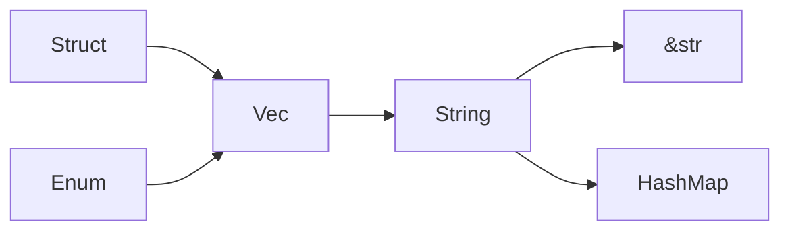
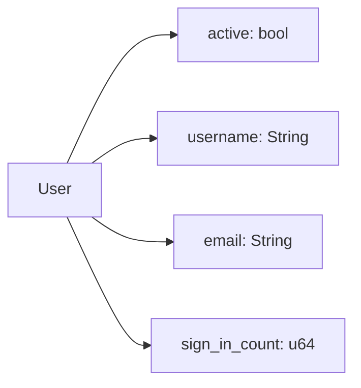
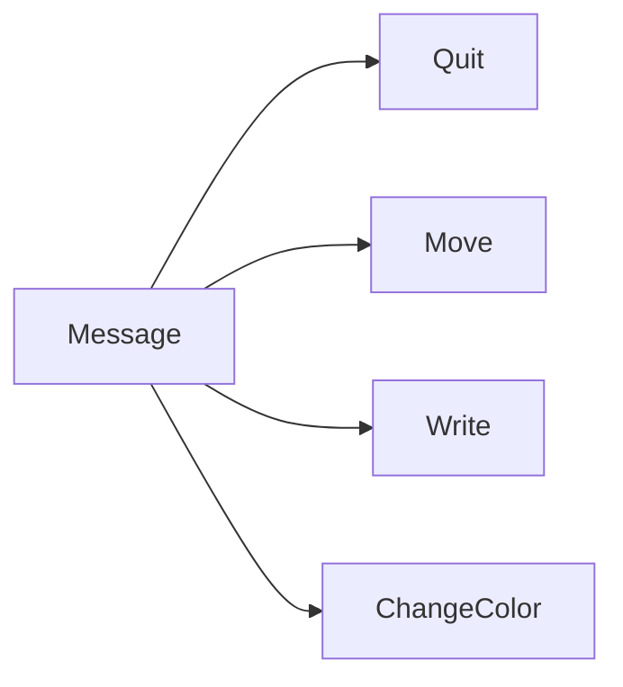
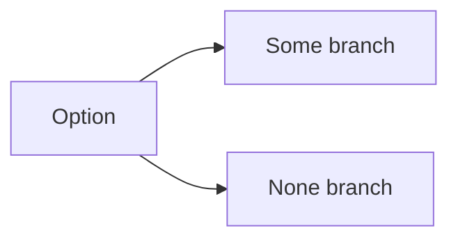
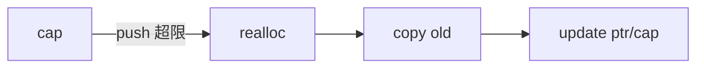
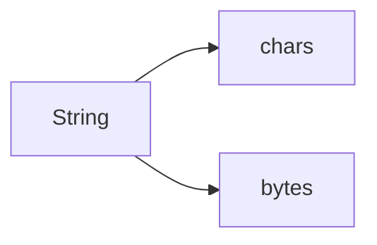
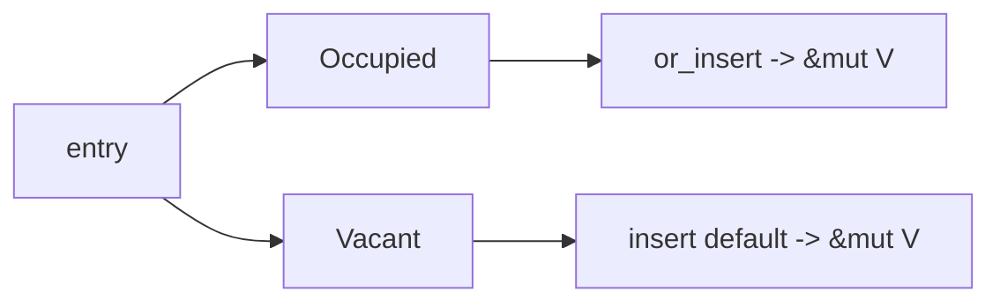

# 第三章：复合类型与集合

本章将介绍 Rust 中组织数据的两种重要方式：结构体（structs）和枚举（enums）。我们还将深入探讨标准库提供的一些非常有用的集合类型，如 Vector、String 和 HashMap。

---

示意图：类型与集合关系



### 41. 什么是结构体 (Struct)？如何定义？

**答：**
结构体（struct）是一种自定义数据类型，允许你将多个相关的值组合在一起并命名。它类似于其他语言中的对象或记录。有三种类型的结构体：

1.  **普通结构体 (Struct):**

```rust
struct User {
    active: bool,
    username: String,
    email: String,
    sign_in_count: u64,
}
// 创建实例
let user1 = User {
    email: String::from("someone@example.com"),
    username: String::from("someusername123"),
    active: true,
    sign_in_count: 1,
};
```

示意图：结构体与字段



2.  **元组结构体 (Tuple Struct):** 当你想给整个元组一个名字，但不需要给每个字段命名时使用。

```rust
struct Color(i32, i32, i32);
let black = Color(0, 0, 0);
```

3.  **单元结构体 (Unit-Like Struct):** 没有任何字段，当你需要在某个类型上实现 trait 但又不需要存储数据时很有用。

```rust
struct AlwaysEqual;
let subject = AlwaysEqual;
```

进阶示例：结构体初始化简写、更新语法与调试输出
```rust
#[derive(Debug)]
struct User {
    active: bool,
    username: String,
    email: String,
    sign_in_count: u64,
}

fn main() {
    let username = String::from("alice");
    let email = String::from("alice@example.com");

    // 字段初始化简写（变量名与字段名相同）
    let mut user1 = User {
        active: true,
        username,
        email,
        sign_in_count: 1,
    };

    // 更新语法（从 user1 拷贝剩余字段；被移动的字段在 user1 上失效）
    let user2 = User {
        email: String::from("alice@work.com"),
        ..user1
    };

    // user1.username 已被移动，不能再使用；但 user1.active 仍可用
    println!("user2 = {:?}", user2);
}
```

---

### 42. 如何为结构体实现方法 (Method)？

**答：**
方法与函数类似，但它们在结构体（或枚举、trait）的上下文中被定义，并且它们的第一个参数总是 `self`，代表调用该方法的结构体实例。方法在 `impl` 块中定义。

```rust

struct Rectangle {
    width: u32,
    height: u32,
}

impl Rectangle {
    // `&self` 是 self: &Self 的缩写
    // 这是一个不可变借用
    fn area(&self) -> u32 {
        self.width * self.height
    }

    // 这是一个可变借用
    fn set_width(&mut self, width: u32) {
        self.width = width;
    }
}

let mut rect = Rectangle { width: 30, height: 50 };
println!("The area is {}", rect.area());
rect.set_width(35);

```

---

### 43. 什么是关联函数 (Associated Function)？

**答：**
关联函数是定义在 `impl` 块中但**不**以 `self` 作为第一个参数的函数。它与结构体关联，但不是实例的方法。其他语言中通常称之为“静态方法”。

创建结构体实例的构造函数是关联函数的常见用法，例如 `String::from`。

```rust
impl Rectangle {
    // 这是一个关联函数，通常用作构造函数
    fn square(size: u32) -> Self {
        Self {
            width: size,
            height: size,
        }
    }
}

// 通过 `::` 语法调用
let sq = Rectangle::square(3);
```

---

### 44. 什么是枚举 (Enum)？它有什么优势？

**答：**
枚举（enum）允许你定义一个可以拥有数个变体（variants）之一的类型。它的强大之处在于，你可以将数据直接附加到枚举的每个变体中。

```rust
enum Message {
    Quit, // 没有关联数据
    Move { x: i32, y: i32 }, // 关联一个匿名结构体
    Write(String), // 关联一个 String
    ChangeColor(i32, i32, i32), // 关联三个 i32
}
```

示意图：Message 变体


优势在于，一个 `Message` 类型的值可以是以上四种变体中的**任何一种**。这允许我们在一个类型中编码多种状态或值的可能性，并且编译器会确保你处理了所有可能的情况。

进阶示例：为枚举实现方法并匹配
```rust
#[derive(Debug)]
enum Message {
    Quit,
    Move { x: i32, y: i32 },
    Write(String),
    ChangeColor(i32, i32, i32),
}

impl Message {
    fn call(&self) {
        match self {
            Message::Quit => println!("quit"),
            Message::Move { x, y } => println!("move to ({}, {})", x, y),
            Message::Write(s) => println!("write: {}", s),
            Message::ChangeColor(r, g, b) => println!("color: ({}, {}, {})", r, g, b),
        }
    }
}

fn main() {
    let m = Message::Move { x: 10, y: 20 };
    m.call();
}
```

---

### 45. `Option` 枚举是什么？为什么它很重要？

**答：**
`Option<T>` 是标准库中一个非常重要的枚举，它用于处理一个值“可能为空”的情况。在很多其他语言中，这由 `null` 或 `nil` 来表示，但 `null` 是一个臭名昭著的 bug 之源。

Rust 没有 `null`，而是使用 `Option<T>`：
```rust
enum Option<T> {
    None, // 表示没有值
    Some(T), // 表示有一个 T 类型的值
}
```
`Option<T>` 让你必须在编译时就处理值不存在的情况，从而避免了在运行时出现“空指针”错误。这使得代码更安全、更健壮。

---

### 46. `match` 控制流运算符是做什么用的？

**答：**
`match` 是一个强大的控制流运算符，它允许一个值与一系列的模式（patterns）进行比较，并根据匹配的模式执行相应的代码。可以把它想象成一个“超级 `if`”。

`match` 的一个关键特性是它是**穷尽的 (exhaustive)**。你必须为所有可能的值编写分支，否则编译器会报错。这与 `Option` 和其他枚举配合使用时尤其强大。

```rust
fn plus_one(x: Option<i32>) -> Option<i32> {
    match x {
        None => None,
        Some(i) => Some(i + 1),
    }
}
```

示意图：Option 匹配流程



---

### 47. `if let` 语法是什么？

**答：**
`if let` 是一种更简洁的语法，用于处理只关心 `match` 中某一个分支的情况。它不要求穷尽所有可能。

```rust
let config_max = Some(3u8);

// 使用 match
match config_max {
    Some(max) => println!("The maximum is configured to be {}", max),
    _ => (), // 对于不关心的分支，必须用 `_` 来处理
}

// 使用 if let，更简洁
if let Some(max) = config_max {
    println!("The maximum is configured to be {}", max);
}
```

---

### 48. 什么是 Vector？如何使用？

**答：**
`Vec<T>`，通常称为 vector，是一个可增长的、在堆上分配的数组类型。它只能存储相同类型 `T` 的值。

```rust
// 创建一个新的 vector
let mut v: Vec<i32> = Vec::new();

// 使用 `vec!` 宏创建并初始化
let v2 = vec![1, 2, 3];

// 添加元素
v.push(5);
v.push(6);

// 读取元素
let third: &i32 = &v2[2]; // 通过索引访问，如果越界会 panic
let fourth: Option<&i32> = v.get(3); // 使用 get，返回 Option，更安全
```

示意图：Vec 扩容流程（概念）



进阶示例：容量、插入删除、排序、去重与保留
```rust
fn main() {
    let mut v = Vec::with_capacity(10);
    v.extend([3, 1, 4, 1, 5, 9]);
    println!("len={}, cap={}", v.len(), v.capacity());

    // 插入与删除
    v.insert(1, 42); // 在索引1插入
    let removed = v.remove(0); // 移除索引0元素
    println!("removed={}, v={:?}", removed, v);

    // 排序与去重（需要可排序元素）
    v.sort();
    v.dedup();
    println!("sorted+dedup: {:?}", v);

    // 过滤保留
    v.retain(|x| *x % 2 == 1);
    println!("保留奇数: {:?}", v);

    // 迭代转换
    let doubled: Vec<_> = v.iter().map(|x| x * 2).collect();
    println!("翻倍: {:?}", doubled);
}
```

---

### 49. 如何遍历 Vector 中的元素？

**答：**
使用 `for` 循环。你可以选择不可变地遍历、可变地遍历或获取所有权。

```rust
let v = vec![100, 32, 57];

// 不可变遍历
for i in &v {
    println!("{}", i);
}

let mut v_mut = vec![100, 32, 57];
// 可变遍历
for i in &mut v_mut {
    *i += 50; // 使用解引用运算符 `*` 来修改值
}
```

---

### 50. Rust 中的字符串 (String) 是如何实现的？

**答：**
`String` 类型实际上是 `Vec<u8>` 的一个包装。它是一个在堆上分配、可增长、可变的 UTF-8 编码的字节序列。

- `String` 拥有其数据的所有权。
- `&str`（字符串切片）是对 `String` 中数据的借用。

---

### 51. 如何创建和更新一个 `String`？

**答：**
```rust
// 创建一个空 String
let mut s = String::new();

// 从字符串字面量创建
let s1 = "initial contents".to_string();
let s2 = String::from("initial contents");

// 更新 String
let mut s3 = String::from("foo");
s3.push_str("bar"); // 追加一个 &str
s3.push('!'); // 追加一个字符

// 使用 `+` 运算符连接（会获得 s3 的所有权）
let s4 = s3 + &s1; 

// 使用 `format!` 宏（不会获得任何参数的所有权）
let s5 = format!("{}-{}-{}", s2, s1, s4);
```

进阶示例：遍历字符与字节、查找与替换、截断与清理
```rust
fn main() {
    let mut s = String::from("héllo, 世界 👋");
    
    // 按字符遍历（Unicode 标量）
    for ch in s.chars() {
        print!("[{}]", ch);
    }
    println!();

    // 按字节遍历
    for b in s.bytes() {
        print!("{} ", b);
    }
    println!();

    // 查找与替换
    if let Some(pos) = s.find('世') {
        println!("'世' 出现在字节位置 {}", pos);
    }
    let replaced = s.replace("hé", "he");
    println!("替换后: {}", replaced);

    // 截断（注意 UTF-8 边界）
    s.truncate(5); // 以字节为单位，需确保在字符边界
    println!("截断后: {}", s);

    // 清空
    s.clear();
    println!("清空后长度: {}", s.len());
}
```

---

### 52. 为什么不能通过索引访问 `String` 的字符？

**答：**
因为 Rust 的 `String` 是 UTF-8 编码的。在 UTF-8 中，一个字符可能占用 1 到 4 个字节。因此，`O(1)` 时间复杂度的索引操作无法保证返回一个有效的字符。

例如，`"नमस्ते"` 这个字符串，从字节上看是 `[224, 164, ...]`，`&s[0]` 并不是一个完整的字符 `'न'`。

如果你确实需要遍历字符，应该使用 `.chars()` 方法。

```rust
for c in "Зд".chars() {
    println!("{}", c); // 会正确打印 'З' 和 'д'
}
```

示意图：String/Chars/Bytes 关系



---

### 53. 什么是 HashMap？如何使用？

**答：**
`HashMap<K, V>` 用于存储键（类型 `K`）和值（类型 `V`）之间的映射关系。它通过哈希函数来实现，可以提供平均 `O(1)` 时间复杂度的访问。

```rust
use std::collections::HashMap;

let mut scores = HashMap::new();

// 插入键值对
scores.insert(String::from("Blue"), 10);
scores.insert(String::from("Yellow"), 50);

// 获取值
let team_name = String::from("Blue");
let score = scores.get(&team_name).copied().unwrap_or(0); // get 返回 Option

// 遍历
for (key, value) in &scores {
    println!("{}: {}", key, value);
}
```

进阶示例：单词计数与 `or_insert_with`
```rust
use std::collections::HashMap;

fn main() {
    let text = "hello world wonderful world";
    let mut counts: HashMap<&str, usize> = HashMap::new();

    for word in text.split_whitespace() {
        *counts.entry(word).or_insert(0) += 1;
    }
    println!("计数: {:?}", counts);

    // 惰性初始化开销较大的默认值
    let mut cache: HashMap<String, String> = HashMap::new();
    let key = "config".to_string();
    let value = cache.entry(key).or_insert_with(|| expensive_load());
    println!("加载值: {}", value);
}

fn expensive_load() -> String {
    // 模拟耗时计算/IO
    "default".to_string()
}
```

---

### 54. HashMap 如何处理键的所有权？

**答：**
对于实现了 `Copy` trait 的类型（如 `i32`），键的值会被复制到 `HashMap` 中。
对于拥有所有权的类型（如 `String`），值的所有权将被**移动**到 `HashMap` 中。

```rust
let field_name = String::from("Favorite color");
let field_value = String::from("Blue");

let mut map = HashMap::new();
map.insert(field_name, field_value);

// field_name 和 field_value 在这里不再有效，因为所有权被移动了
// println!("{}", field_name); // 编译错误！
```

---

### 55. 如何在 HashMap 中只在键不存在时插入值？

**答：**
使用 `entry` API，它返回一个名为 `Entry` 的枚举。`or_insert` 方法会在键不存在时插入给定的值，并返回一个可变的引用。

这是一种非常高效和简洁的处理方式，避免了先检查再插入的两步操作。

```rust
let mut scores = HashMap::new();
scores.insert(String::from("Blue"), 10);

// "Blue" 键已存在，什么都不做
scores.entry(String::from("Blue")).or_insert(50);

// "Red" 键不存在，插入 30
scores.entry(String::from("Red")).or_insert(30);

println!("{:?}", scores); // {"Blue": 10, "Red": 30}
```

示意图：HashMap entry API 分支


