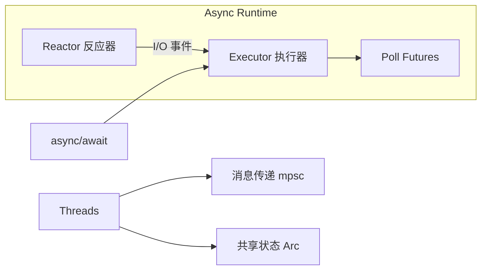
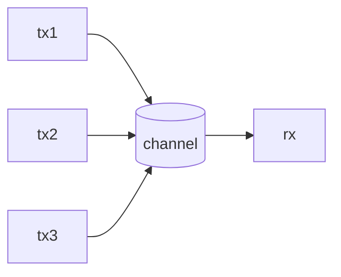
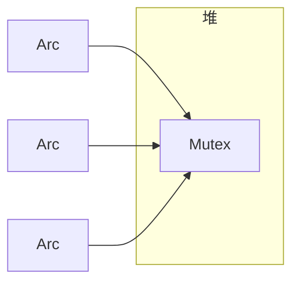

# 第五章：并发与异步

Rust 提供了强大的工具来安全地编写并发甚至并行的代码。它的所有权和类型系统在编译时就为你解决了许多常见的并发问题。本章将介绍线程、消息传递、共享状态以及 Rust 的 `async/await` 语法。

---

示意图：并发与异步模型



### 76. 如何在 Rust 中创建一个新线程？

**答：**
使用 `std::thread::spawn` 函数。它接受一个闭包作为参数，这个闭包包含了你想在新线程中运行的代码。

```rust
use std::thread;
use std::time::Duration;

// 创建一个新线程
let handle = thread::spawn(|| {
    for i in 1..10 {
        println!("hi number {} from the spawned thread!", i);
        thread::sleep(Duration::from_millis(1));
    }
});

// 主线程的代码会继续执行
for i in 1..5 {
    println!("hi number {} from the main thread!", i);
    thread::sleep(Duration::from_millis(1));
}

// 等待新线程执行完毕
handle.join().unwrap();
```
`spawn` 函数返回一个 `JoinHandle`，调用它的 `join` 方法可以阻塞当前线程，直到被调用的线程执行完毕。

---

### 77. 为什么在 `thread::spawn` 中经常使用 `move` 闭包？

**答：**
因为 `thread::spawn` 创建的新线程可能会比创建它的主线程活得更久。为了保证新线程中引用的数据是有效的，我们需要将这些数据的所有权**移动**到新线程中。

`move` 关键字强制闭包获取它所使用的所有环境变量的所有权。这是一种向 Rust 编译器保证，该闭包不会意外地引用一个可能在未来被主线程释放掉的变量。

```rust
let v = vec![1, 2, 3];

// `move` 将 v 的所有权转移到新线程
let handle = thread::spawn(move || {
    println!("Here's a vector: {:?}", v);
});

// drop(v); // 如果在这里尝试使用 v，会编译错误，因为所有权已经转移

handle.join().unwrap();
```

---

### 78. 什么是通道 (Channel)？它如何用于线程间通信？

**答：**
通道是 Rust 中一种常见的、用于线程间**消息传递**的编程模型。你可以把它想象成一个单向的管道：一端是发送者 (Transmitter)，另一端是接收者 (Receiver)。

Rust 的标准库在 `std::sync::mpsc` 模块中提供了通道的实现。`mpsc` 代表“多个生产者，单个消费者”（multiple producer, single consumer）。

```rust
use std::sync::mpsc;
use std::thread;

let (tx, rx) = mpsc::channel(); // tx 是发送者, rx 是接收者

thread::spawn(move || {
    let val = String::from("hi");
    tx.send(val).unwrap(); // send 会获取所有权
});

let received = rx.recv().unwrap(); // recv 会阻塞主线程直到接收到消息
println!("Got: {}", received);
```

示意图：多生产者通道



进阶示例：多个生产者与接收循环、超时接收
```rust
use std::sync::mpsc;
use std::thread;
use std::time::Duration;

fn main() {
    let (tx, rx) = mpsc::channel::<String>();

    // 多个生产者：克隆发送端
    for id in 0..3 {
        let tx_clone = tx.clone();
        thread::spawn(move || {
            for i in 0..3 {
                let msg = format!("producer#{id} -> {i}");
                tx_clone.send(msg).unwrap();
                thread::sleep(Duration::from_millis(20));
            }
        });
    }
    drop(tx); // 关闭原始发送端，确保接收端在生产者结束后退出循环

    // 接收循环
    for msg in rx.iter() {
        println!("recv: {}", msg);
    }

    // 使用 recv_timeout 等待一段时间
    let (tx2, rx2) = mpsc::channel();
    thread::spawn(move || thread::sleep(Duration::from_millis(200)));
    match rx2.recv_timeout(Duration::from_millis(100)) {
        Ok(v) => println!("got {}", v),
        Err(e) => println!("timeout or closed: {}", e),
    }
}
```

---

### 79. 什么是互斥锁 (Mutex)？如何使用它在线程间共享状态？

**答：**
互斥锁（Mutex, mutual exclusion）是一种只允许一个线程在任意时刻访问某些数据的机制。要访问数据，线程必须首先获取互斥锁的“锁”（lock）。当线程使用完数据后，它必须“解锁”（unlock），这样其他线程才能获取锁并访问数据。

在 Rust 中，我们使用 `std::sync::Mutex<T>`。

```rust
use std::sync::Mutex;
use std::thread;

let m = Mutex::new(5);

{
    let mut num = m.lock().unwrap(); // 获取锁，返回一个 MutexGuard
    *num = 6;
} // 锁在这里被自动释放

println!("m = {:?}", m);
```
`lock()` 方法返回的是一个智能指针 `MutexGuard`。当 `MutexGuard` 离开作用域时，锁会自动被释放。这极大地避免了忘记解锁导致的死锁问题。

---

进阶示例：`RwLock` 与锁毒化处理
```rust
use std::sync::{RwLock, PoisonError};

fn main() {
    let data = RwLock::new(vec![1, 2, 3]);

    // 多个读者
    {
        let r1 = data.read().unwrap();
        let r2 = data.read().unwrap();
        println!("reads: {:?}, {:?}", *r1, *r2);
    }

    // 写者
    {
        let mut w = data.write().unwrap();
        w.push(4);
    }

    // 锁毒化示例
    let bad = RwLock::new(0);
    let res = std::panic::catch_unwind(|| {
        let mut g = bad.write().unwrap();
        *g = 10;
        panic!("oops");
    });
    if res.is_err() {
        let recovered = match bad.write() {
            Ok(g) => *g,
            Err(PoisonError { .. }) => {
                // 恢复访问毒化的锁
                let g = bad.write().unwrap_or_else(|e| e.into_inner());
                *g
            }
        };
        println!("recovered value = {}", recovered);
    }
}
```

### 80. `Arc<T>` 是什么？为什么它经常和 `Mutex<T>` 一起使用？

**答：**
`Arc<T>` 是**原子引用计数 (Atomically Reference Counted)** 智能指针。它和 `Rc<T>` 功能类似，都允许多个所有者共享数据，但 `Arc<T>` 是**线程安全**的。

- 当你想在多个线程之间共享数据的所有权时，`Arc<T>` 是必需的。`Rc<T>` 不能被安全地在线程间传递。
- `Mutex<T>` 保证了在任意时刻只有一个线程能修改数据。
- 但是 `Mutex<T>` 本身并不允许多个所有者。

因此，`Arc<Mutex<T>>` 是一个非常强大的组合：
- `Arc<T>` 允许多个线程“拥有”指向互斥锁的指针。
- `Mutex<T>` 保证了对内部数据的访问是互斥的、线程安全的。

```rust
use std::sync::{Mutex, Arc};
use std::thread;

let counter = Arc::new(Mutex::new(0));
let mut handles = vec![];

for _ in 0..10 {
    let counter = Arc::clone(&counter);
    let handle = thread::spawn(move || {
        let mut num = counter.lock().unwrap();
        *num += 1;
    });
    handles.push(handle);
}

for handle in handles {
    handle.join().unwrap();
}

println!("Result: {}", *counter.lock().unwrap()); // 打印 10
```

示意图：Arc<Mutex<T>> 共享计数器



---

进阶示例：简单线程池（工作窃取的极简雏形）
```rust
use std::sync::{Arc, Mutex, mpsc};
use std::thread;

type Job = Box<dyn FnOnce() + Send + 'static>;

struct ThreadPool {
    workers: Vec<thread::JoinHandle<()>>,
    sender: mpsc::Sender<Job>,
}

impl ThreadPool {
    fn new(size: usize) -> Self {
        let (tx, rx) = mpsc::channel::<Job>();
        let rx = Arc::new(Mutex::new(rx));
        let mut workers = Vec::new();
        for _ in 0..size {
            let rx = Arc::clone(&rx);
            workers.push(thread::spawn(move || loop {
                match rx.lock().unwrap().recv() {
                    Ok(job) => job(),
                    Err(_) => break,
                }
            }));
        }
        Self { workers, sender: tx }
    }

    fn execute<F>(&self, f: F)
    where
        F: FnOnce() + Send + 'static,
    {
        self.sender.send(Box::new(f)).unwrap();
    }
}
```

### 81. `Send` 和 `Sync` trait 有什么作用？

**答：**
`Send` 和 `Sync` 是两个特殊的标记 trait，它们是 Rust 并发模型的核心。

- **`Send`**: 如果一个类型 `T` 实现了 `Send`，意味着 `T` 类型的值的所有权可以被安全地**在线程间传递**。几乎所有 Rust 类型都实现了 `Send`，主要的例外是 `Rc<T>` 和原始指针。
- **`Sync`**: 如果一个类型 `T` 实现了 `Sync`，意味着 `&T`（对 `T` 的不可变引用）可以被安全地**在线程间共享**。换句话说，如果 `&T` 是 `Send` 的，那么 `T` 就是 `Sync` 的。

这两个 trait 是自动为组合了 `Send` 和 `Sync` 类型的复合类型实现的。你不需要手动去实现它们，但它们保证了 Rust 的并发安全性是在编译时就被检查的。

---

### 82. 什么是异步编程 (Async Programming)？

**答：**
异步编程是一种允许程序在等待一个长时间操作（如文件读写、网络请求）完成时，可以继续执行其他任务的编程范式。它通过非阻塞的方式来提高程序的效率和响应能力。

在传统的同步代码中，当一个函数等待 I/O 时，整个线程都会被阻塞。在异步代码中，当一个任务需要等待时，它可以将控制权交还给运行时（runtime），运行时则可以去执行另一个已经准备好的任务。

---

### 83. `async` 和 `await` 关键字是做什么用的？

**答：**
`async` 和 `await` 是 Rust 中进行异步编程的两个核心关键字。

- **`async`**: 当你用 `async` 标记一个函数时，它会把这个函数变成一个返回**Future**的函数。Future 是一个代表未来某个时刻才会完成的值。`async` 函数本身并不会执行，它只是构建一个 Future。
- **`await`**: 当你在一个 Future 上使用 `.await` 时，它会暂停当前 `async` 函数的执行，直到这个 Future 完成。在暂停期间，线程不会被阻塞，而是可以去执行其他任务。

```rust
async fn do_something() {
    println!("Going to do something");
    // 模拟一个异步操作
    let result = some_async_operation().await; 
    println!("Got result: {}", result);
}
```

进阶示例（Tokio）：并发任务、select 与超时、取消
```rust
use tokio::time::{self, Duration};

async fn work(id: u32) -> u32 {
    time::sleep(Duration::from_millis(50 * id as u64)).await;
    id
}

#[tokio::main]
async fn main() {
    // 并发执行多个任务
    let (a, b) = tokio::join!(work(1), work(2));
    println!("results: {}, {}", a, b);

    // 超时
    let res = time::timeout(Duration::from_millis(60), work(2)).await;
    println!("timeout result: {:?}", res);

    // select 选择先完成的任务
    tokio::select! {
        val = work(1) => println!("first done: {}", val),
        _ = work(3) => println!("second done"),
    }

    // 取消：丢弃 future 即可
    let fut = work(5);
    drop(fut); // 被取消，不会完成
}
```

---

### 84. 什么是 Future？

**答：**
`Future` 是一个 trait，它代表一个可以被轮询（polled）的异步计算。它只有一个 `poll` 方法。

```rust
trait Future {
    type Output;
    fn poll(self: Pin<&mut Self>, cx: &mut Context<'_>) -> Poll<Self::Output>;
}
```
当一个 future 被 `poll` 时，它会尝试取得进展。`poll` 方法会返回：
- `Poll::Ready(value)`: 表示 future 已经完成，并产出了一个值。
- `Poll::Pending`: 表示 future 还没有准备好，它会在准备好时通过 `Context` 通知执行器再次轮询它。

你通常不需要手动实现 `Future` trait，`async/await` 语法会为你自动生成。

---

### 85. 什么是异步运行时 (Async Runtime)？

**答：**
异步运行时是一个库，它负责执行异步代码。它包含一个**执行器 (executor)**，负责接收顶层的 Future (`async` 函数)，并通过不断轮询（poll）来驱动它们直到完成。它还包含一个**反应器 (reactor)**，负责处理外部 I/O 事件（如网络套接字准备好读写），并在事件发生时唤醒相应的 Future。

Rust 语言本身只提供了 `async/await` 语法和 `Future` trait，但**没有**内置运行时。你需要自己选择一个社区提供的运行时库。最流行的运行时包括：
- `tokio`: 功能最强大、生态最完善的运行时，适用于网络服务。
- `async-std`: 模仿标准库 API 的运行时，学习曲线平缓。
- `smol`: 一个小巧、简单的运行时。
