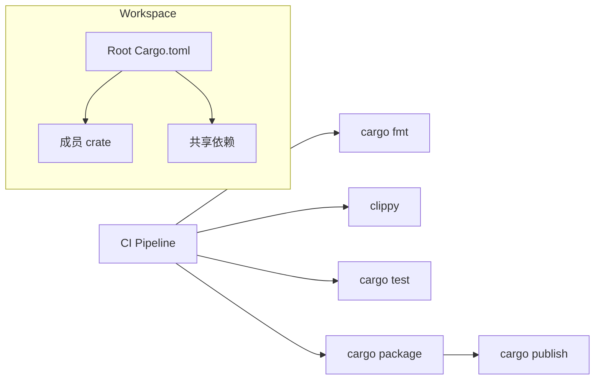

# 第六章：项目与生态

恭喜你！来到了本书的最后一章。本章我们将学习如何组织大型项目、编写有效的测试、处理错误，并了解 Rust 强大的生态系统，包括如何使用和发布 crate。

---

示意图：工作空间与发布流水线



### 86. 如何在 Rust 中组织一个复杂的项目？模块系统是如何工作的？

**答：**
Rust 有一个强大的模块系统，可以帮助你将代码组织成多个文件和目录。
- **Crate**: 是 Rust 的编译单元。一个 crate 可以是一个二进制程序或一个库。
- **Module**: 使用 `mod` 关键字，你可以在一个文件中定义一个模块，或者从另一个文件加载一个模块。
- **`src/main.rs`**: 是二进制 crate 的 crate root。
- **`src/lib.rs`**: 是库 crate 的 crate root。

**文件结构示例:**
```
src/
├── main.rs
├── lib.rs
└── front_of_house/
    ├── hosting.rs
    └── serving.rs
```

**`src/lib.rs`:**
```rust
// 从 front_of_house/hosting.rs 加载模块
mod front_of_house; 

// 使用 pub use 重新导出，方便外部调用
pub use crate::front_of_house::hosting;

pub fn eat_at_restaurant() {
    hosting::add_to_waitlist();
}
```
**`src/front_of_house/hosting.rs`:**
```rust
pub fn add_to_waitlist() {}
```
使用 `use` 关键字可以将路径引入作用域，从而使用更短的名称来调用函数。

---

进阶示例：模块可见性、`pub(crate)` 与重导出
```rust
// lib.rs
mod util {
    pub(crate) fn helper() {}
}

pub use util::helper; // 重新导出为公共 API
```

### 87. `pub` 关键字是做什么的？

**答：**
`pub` 关键字用于将模块、函数、结构体、枚举等标记为**公共的 (public)**，这意味着模块外的代码可以访问它们。默认情况下，Rust 中的所有项都是**私有的 (private)**。

- `pub fn my_function()`: 使函数变为公共。
- `pub struct MyStruct`: 使结构体变为公共，但它的**字段**默认仍然是私有的。你必须在每个需要公开的字段前也加上 `pub`。
- `pub enum MyEnum`: 使枚举变为公共，它的**所有变体**也都会自动变为公共。

---

### 88. 什么是 Crate？它和 Module 有什么区别？

**答：**
- **Crate**: 是一个独立的、可编译的单元。它可以生成一个可执行文件（二进制 crate）或一个可被其他项目用作依赖的库（库 crate）。`cargo build` 或 `cargo run` 命令操作的对象就是一个 crate。
- **Module**: 是在一个 crate 内部组织代码的一种方式。它定义了一个命名空间，可以包含函数、结构体以及其他模块。模块帮助你控制代码的组织和可见性（私有/公共）。

简单来说：一个项目（包）包含一个或多个 crate，一个 crate 包含一个或多个 module。

---

### 89. 如何使用外部的 Crate？

**答：**
通过 `Cargo.toml` 文件。
1.  在 `Cargo.toml` 的 `[dependencies]` 部分添加你需要的 crate 和版本号。
    ```toml
    [dependencies]
    rand = "0.8.5"
    ```
2.  运行 `cargo build`，Cargo 会自动从 [crates.io](https://crates.io)（Rust 的官方包仓库）下载并编译这个依赖。
3.  在你的代码中使用 `use` 关键字来引入这个 crate 的功能。
    ```rust
    use rand::Rng;

    fn main() {
        let mut rng = rand::thread_rng();
        let n: u32 = rng.gen_range(1..=100);
        println!("Random number: {}", n);
    }
    ```

---

### 90. `Result<T, E>` 枚举是什么？它如何用于错误处理？

**答：**
`Result<T, E>` 是标准库中用于可恢复错误处理的核心枚举。
```rust
enum Result<T, E> {
    Ok(T),  // 表示操作成功，并包含一个 T 类型的值
    Err(E), // 表示操作失败，并包含一个 E 类型的错误信息
}
```
函数在可能失败时，应该返回 `Result` 类型。这强制调用者必须处理错误的可能性，从而使代码更健壮。你可以使用 `match`、`if let` 或更简洁的 `?` 运算符来处理 `Result`。

---

进阶示例：`thiserror` 定义库错误，`anyhow` 用于应用层
```rust
// Cargo.toml
// thiserror = "1", anyhow = "1"

use thiserror::Error;

#[derive(Debug, Error)]
pub enum MyError {
    #[error("io error: {0}")] Io(#[from] std::io::Error),
    #[error("parse int error: {0}")] Parse(#[from] std::num::ParseIntError),
}

pub fn parse_num(s: &str) -> Result<i32, MyError> {
    Ok(s.trim().parse()?)
}

fn main() -> anyhow::Result<()> {
    let n = parse_num("42")?;
    println!("{}", n);
    Ok(())
}
```

### 91. `panic!` 和 `Result` 有什么区别？应该在什么时候使用它们？

**答：**
- **`panic!`**: 用于不可恢复的错误。当 `panic!` 被调用时，程序会立即停止执行，展开并清理栈，然后退出。它应该用于表示程序进入了一个它无法处理的、不应该发生的状态（例如，编程 bug）。
- **`Result<T, E>`**: 用于可恢复的错误。当一个错误是可预期的，并且调用者应该有能力去处理它时（例如，文件未找到、网络请求失败），你应该返回一个 `Result`。

**经验法则**：如果一个函数因为调用者传递了不合法的值而失败，那么 `panic!` 是合适的。如果失败的原因来自外部环境，那么返回 `Result` 更合适。

---

### 92. `?` 运算符是做什么用的？

**答：**
`?` 运算符是用于**错误传播**的语法糖。它可以极大地简化处理 `Result` 和 `Option` 的代码。

当你在一个 `Result` 值后面使用 `?` 时：
- 如果 `Result` 是 `Ok(value)`，它会解包 `Result` 并将 `value` 作为表达式的结果。
- 如果 `Result` 是 `Err(e)`，它会立即从当前函数返回，并将这个 `Err(e)` 作为整个函数的返回值。

`?` 运算符只能在返回 `Result` 或 `Option`（或其他实现了 `Try` trait 的类型）的函数中使用。

```rust
use std::fs::File;
use std::io::{self, Read};

// 使用 `?` 运算符，代码非常简洁
fn read_username_from_file() -> Result<String, io::Error> {
    let mut username_file = File::open("hello.txt")?;
    let mut username = String::new();
    username_file.read_to_string(&mut username)?;
    Ok(username)
}
```

---

### 93. 如何在 Rust 中编写测试？

**答：**
Rust 内置了对单元测试和集成测试的支持。
- **单元测试 (Unit Tests):** 通常与被测试的代码放在同一个文件中，位于一个标记了 `#[cfg(test)]` 的 `mod tests` 模块里。它们用于测试私有函数。
- **集成测试 (Integration Tests):** 位于项目根目录下的 `tests` 文件夹中。每个 `.rs` 文件都是一个独立的 crate。它们只能测试库的公共 API。

测试函数需要用 `#[test]` 属性来标注。

```rust
// 在 `src/lib.rs` 中
pub fn add_two(a: i32) -> i32 {
    a + 2
}

#[cfg(test)]
mod tests {
    use super::*; // 引入外部模块

    #[test]
    fn it_adds_two() {
        assert_eq!(4, add_two(2));
    }

    #[test]
    #[should_panic] // 测试应该 panic 的情况
    fn it_panics() {
        // ...
    }
}
```
使用 `cargo test` 来运行所有测试。

---

### 94. `assert!`、`assert_eq!` 和 `assert_ne!` 宏有什么区别？

**答：**
它们都是在测试中常用的断言宏：
- **`assert!(expression)`**: 接受一个布尔表达式。如果表达式为 `true`，测试通过；如果为 `false`，则 `panic`。
- **`assert_eq!(left, right)`**: 比较两个参数是否相等。如果 `left == right`，测试通过。如果不等，它会 `panic` 并清晰地打印出两个参数的值，方便调试。
- **`assert_ne!(left, right)`**: 比较两个参数是否不相等。如果 `left != right`，测试通过。

在大多数情况下，`assert_eq!` 和 `assert_ne!` 比 `assert!` 更好，因为它们能在失败时提供更多的上下文信息。

---

### 95. 什么是文档测试 (Doc Tests)？

**答：**
文档测试是写在文档注释 (`///`) 中的代码示例。Rust 的测试工具 `cargo test` 会自动提取这些代码示例，将它们编译并作为测试来运行。

这是一种非常强大的功能，它保证了你的文档示例永远不会过时或包含错误。

```rust
/// Adds two to the number given.
///
/// # Examples
///
/// ```
/// let arg = 5;
/// let answer = my_crate::add_two(arg);
///
/// assert_eq!(7, answer);
/// ```
pub fn add_two(a: i32) -> i32 {
    a + 2
}
```
运行 `cargo test` 时，上面 `Examples` 部分的代码就会被执行。

---

进阶示例：测试夹具与 `#[test]` 辅助函数
```rust
// tests/common/mod.rs
pub fn setup() { /* create temp dirs, set env, etc. */ }

// tests/integration.rs
mod common;

#[test]
fn it_works() {
    common::setup();
    assert_eq!(2 + 2, 4);
}
```

### 96. 什么是基准测试 (Benchmarking)？

**答：**
基准测试用于衡量代码的运行速度。Rust 的标准测试工具目前还不支持稳定的基准测试。你需要使用 nightly 版本的 Rust 编译器，或者使用社区开发的库。

最流行的基准测试库是 **`Criterion`**。你需要将它添加到 `[dev-dependencies]` 中，并在 `benches` 目录下创建基准测试文件。

---

### 97. 什么是 Cargo 工作空间 (Workspaces)？

**答：**
工作空间可以帮助你管理多个相互关联的、需要协同开发的 crate。一个工作空间有一个顶层的 `Cargo.toml` 文件，它不包含 `[package]` 部分，而是定义了工作空间的成员。

所有在工作空间中的 crate 共享一个 `target` 目录（存放编译结果）和一个 `Cargo.lock` 文件。这可以节省编译时间并保证所有 crate 使用相同版本的依赖。

---

进阶示例：工作空间顶层配置与成员
```toml
# Cargo.toml (workspace root)
[workspace]
members = ["crates/app", "crates/lib"]
resolver = "2"

[workspace.package]
edition = "2021"

[workspace.dependencies]
serde = { version = "1", features = ["derive"] }
```

### 98. 如何发布我自己的 Crate 到 crates.io？

**答：**
1.  **登录:** 使用 `cargo login` 命令，并粘贴从 [crates.io](https://crates.io/me) 获取的 API token。
2.  **添加元数据:** 确保你的 `Cargo.toml` 文件中包含了必要的元数据，如 `name`, `version`, `authors`, `description`, `license`。
3.  **打包:** 运行 `cargo package` 可以检查你的包是否能成功构建并打包成 `.crate` 文件。
4.  **发布:** 运行 `cargo publish`。这会上传你的 `.crate` 文件到 crates.io。

注意：发布一个版本是**永久性的**，你不能覆盖它，只能发布新的版本。

---

进阶示例：发布前自检清单
```bash
cargo fmt --all -- --check
cargo clippy --all-targets --all-features -- -D warnings
cargo test --all --all-features
cargo publish --dry-run
```

### 99. Rust 生态中有哪些必知的 Crate？

**答：**
Rust 的生态系统非常丰富。以下是一些几乎在所有领域都会遇到的核心 crate：
- **`serde`**: 用于高效、通用地序列化和反序列化 Rust 数据结构（例如，转换成 JSON）。
- **`rand`**: 提供随机数生成功能。
- **`regex`**: 官方维护的正则表达式库。
- **`tokio` / `async-std`**: 异步运行时。
- **`slog` / `log` + `env_logger`**: 用于日志记录。
- **`clap` / `structopt`**: 用于构建强大的命令行应用。
- **`anyhow` / `thiserror`**: 用于更灵活、更易于使用的错误处理。
- **`reqwest`**: 一个强大、易用的 HTTP 客户端。
- **`actix-web` / `rocket` / `axum`**: 用于构建 Web 服务的框架。

---

### 100. 学习 Rust 的下一步是什么？

**答：**
恭喜你完成了 100 问！你已经掌握了 Rust 的核心。下一步是**实践**。
1.  **做项目:** 尝试用 Rust 写一些你感兴趣的东西，比如一个命令行工具、一个简单的 Web 服务器、一个小游戏等。
2.  **阅读代码:** 阅读一些优秀开源项目的代码，比如 `ripgrep`、`fd` 等，学习别人是如何组织代码和解决问题的。
3.  **参与社区:** 加入 Rust 的社区论坛（users.rust-lang.org）、Discord 或 Reddit，提问并帮助他人。
4.  **深入探索:** 阅读《The Rustonomicon》来了解不安全 Rust 的世界，或者阅读《Async Programming in Rust》来深入理解异步。

祝你在 Rust 的世界里探索愉快！
