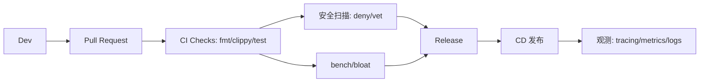

# 第七章：工程与进阶专题

本章聚焦 Rust 的工程化实践与语言进阶主题，涵盖宏、unsafe/FFI、类型系统高阶概念、内存与并发模型、异步进阶、性能优化、工具链与发布、no_std/嵌入式/WebAssembly 等方向，帮助你把基础能力升级为生产级能力。

---

示意图：工程化观测与 CI/CD



### 101. 如何编写 `macro_rules!` 宏？重复匹配语法怎么用？

**答：**
`macro_rules!` 是声明式宏，通过“匹配-替换”规则展开代码。常见片段说明：`ident` 标识符，`expr` 表达式，`ty` 类型，`tt` 语法树标记等。重复语法使用 `$( ... ),*`（逗号分隔零个或多个）或 `+`（至少一个）。
```rust
macro_rules! vec_of_strings {
    ( $( $s:expr ),* $(,)? ) => {{
        let mut v = Vec::new();
        $( v.push($s.to_string()); )*
        v
    }};
}
let v = vec_of_strings!("a", "b", "c");
```

进阶示例：宏条件分支与调试
```rust
macro_rules! debug_ln {
    ($($t:tt)*) => {{
        #[cfg(debug_assertions)] { println!($($t)*); }
        #[cfg(not(debug_assertions))] { () }
    }}
}
```

---

### 102. 过程宏有哪些类型？如何用 `syn`/`quote` 编写？

**答：**
过程宏分为三类：派生宏 `#[derive(MyDerive)]`，属性宏 `#[my_attr]`，函数式宏 `my_macro!{}`。实现步骤：解析 TokenStream（`syn`）、构造/变换 AST、生成 TokenStream（`quote!`）。
```rust
// 简化示例：派生宏
#[proc_macro_derive(Hello)]
pub fn hello(input: TokenStream) -> TokenStream {
    let ast = syn::parse_macro_input!(input as syn::DeriveInput);
    let name = &ast.ident;
    quote::quote! { impl #name { pub fn hello() { println!("hello"); } } }
        .into()
}
```

---

### 103. 如何调试宏展开？

**答：**
使用 `cargo expand` 查看展开后的代码，定位匹配分支与生成结果；对 `macro_rules!` 可分步引入中间宏；过程宏中可打印/`dbg!` AST 片段或用 `eprintln!` 调试。

---

### 104. `unsafe` 提供的五类能力是什么？如何审计使用？

**答：**
五类能力：解引用裸指针、调用 `unsafe` 函数/方法、访问/修改可变静态变量、实现 `unsafe` trait、访问 `union` 非活跃字段。审计要点：缩小 `unsafe` 作用域、建立不变式（文档化）、以安全 API 包裹不安全细节并测试/模糊测试。

---

### 105. 与 C 互操作的关键点有哪些？

**答：**
- ABI：使用 `extern "C"`、`#[repr(C)]` 保证布局与调用约定。
- 绑定：用 `bindgen` 生成 Rust 绑定；用 `cbindgen` 为 C 生成头文件。
- 指针/所有权：明确内存所有者与释放职责，避免双重释放；跨边界传 `*mut T/*const T` 或句柄。

---

### 106. 原始指针的别名/对齐有哪些陷阱？

**答：**
- 别名（aliasing）：同一内存若被可变引用与不可变引用同时观察会触发 UB。
- 对齐（alignment）：按类型对齐访问内存，未对齐读取是 UB。
- 生命周期：原始指针不携带生命周期，需自证安全；优先用切片/引用。

---

### 107. 什么是关联类型（Associated Types），何时优于泛型参数？

**答：**
关联类型将类型参数绑定到 trait 上，减少泛型传播与调用点冗长，适合“每个实现固定一种关联类型”的场景。
```rust
trait Iterator { type Item; fn next(&mut self) -> Option<Self::Item>; }
```

---

### 108. 什么是 GATs（泛型关联类型）？

**答：**
GATs 允许关联类型自身带泛型参数，常用于借用关联的迭代器/视图类型。
```rust
trait LendingIter {
    type Item<'a> where Self: 'a;
    fn next<'a>(&'a mut self) -> Option<Self::Item<'a>>;
}
```

---

### 109. 何时需要高阶生命周期约束 HRTB（`for<'a>`）？

**答：**
当需要表达“对所有生命周期均成立”的约束，如接收 `Fn(&'a T)` 的泛型函数：
```rust
fn call_for_all<'t, F>(f: F) where F: for<'a> Fn(&'a str) { f("hi"); }
```

---

### 110. 什么是对象安全（Object Safety），为何有些 trait 不能做对象？

**答：**
可作为 trait object（`dyn Trait`）的条件包括：方法不返回 `Self`、不含泛型、`where Self: Sized` 限制仅用于不可见方法等。违反则无法动态分发。

---

### 111. `PhantomData` 与变型（variance）有什么关系？

**答：**
`PhantomData<T>` 用于在零大小类型中声明对 `T` 的拥有或借用关系，影响变型与 drop 检查；可用来表达协变/逆变/不变语义并参与自动派生。

---

### 112. `Pin/Unpin` 的语义是什么？

**答：**
`Pin<&mut T>` 保证被固定后的 `T` 不会再被移动（地址稳定）。`Unpin` 类型可随意移动；`!Unpin`（如自引用 Future）需要 `Pin` 保障。常见于异步状态机与生成器。

代码示例：固定自引用结构
```rust
use std::pin::Pin;
use std::marker::PhantomPinned;

struct SelfRef {
    data: String,
    ptr: *const String,
    _p: PhantomPinned,
}

impl SelfRef {
    fn new(txt: &str) -> Self {
        Self { data: txt.into(), ptr: std::ptr::null(), _p: PhantomPinned }
    }
    fn init(self: Pin<&mut Self>) {
        let this = unsafe { self.get_unchecked_mut() };
        this.ptr = &this.data as *const _;
    }
}
```

---

### 113. `Cell/RefCell/UnsafeCell` 有何区别？

**答：**
- `Cell<T>`：按值 get/set，适合 `Copy` 或小对象。
- `RefCell<T>`：运行时借用检查，提供 `borrow/borrow_mut`。
- `UnsafeCell<T>`：内部可变性的底层原语，自行保证安全。

---

### 114. 如何避免 `Rc` 循环引用导致泄漏？`Weak` 如何使用？

**答：**
在父子/图结构中，以 `Rc` 强引用表示所有权，以 `Weak` 弱引用打破环。升级前用 `weak.upgrade()` 判断是否存活。

---

### 115. 原子类型与内存序如何选择？

**答：**
- `Relaxed`：仅原子性，无顺序保证。
- `Acquire/Release/AcqRel`：建立跨线程的 happens-before。
- `SeqCst`：最强，全局总序。默认首选 `Acquire/Release`，仅在需要全局一致时用 `SeqCst`。

---

### 116. 选择 `parking_lot`、`crossbeam`、`rayon` 的原则？

**答：**
- `parking_lot`：更快的锁/条件变量替代。
- `crossbeam`：无锁结构、内存管理、MPSC 更强实现。
- `rayon`：数据并行，迭代器 `par_iter()` 一行并行化。

---

### 117. `Mutex` 锁毒化（poisoning）是什么？如何处理？

**答：**
持锁代码 `panic` 后互斥量被毒化，后续 `lock()` 返回 `PoisonError`。可选择 `into_inner()` 取回、或记录并重建状态；`parking_lot` 默认无毒化。

---

### 118. 什么是 `Stream`？如何与 `async` 协同？

**答：**
`Stream<Item>` 类似异步迭代器，`next().await` 产出元素。使用 `futures::stream` 组合子或 `tokio_stream`，配合 `select`/`timeout` 实现多路异步处理。

进阶示例：`tokio_stream` 构造与消费
```rust
use tokio_stream::{self as stream, StreamExt};

#[tokio::main]
async fn main() {
    let s = stream::iter(vec![1,2,3]);
    let sum: i32 = s.map(|x| x * 2).sum().await;
    println!("{}", sum);
}
```

---

### 119. 如何实现取消、超时与选择（`select`）？

**答：**
`tokio::select!` 合并多个 Future，先完成者赢；`tokio::time::timeout` 实现超时；取消通过 `drop` Future 或使用取消令牌（`CancellationToken`）。

---

### 120. 什么是 `!Send` Future？何时用 `spawn_blocking`？

**答：**
捕获 `!Send` 类型的 Future 不能跨线程调度，需在当前线程执行器上运行（`LocalSet`）。阻塞型 CPU/I/O 任务应使用 `spawn_blocking` 以免卡住 reactor 线程。

---

### 121. 为什么借用不能穿越 `.await`？如何重构？

**答：**
`.await` 可能在挂起点移动状态机，持有借用会延长生命周期导致冲突。重构方式：缩小借用作用域、克隆必要数据、拆分函数、使用所有权传递。

---

### 122. 编译与链接层面的性能优化有哪些？

**答：**
`Cargo.toml [profile]` 配置 `lto=true`、`codegen-units=1`、`opt-level=z/s`、`panic=abort`；启用 `strip`、`RUSTFLAGS` 指令集优化（如 `-C target-cpu=native`）。

---

### 123. 如何进行性能与体积剖析？

**答：**
基准：`criterion`。火焰图：`cargo flamegraph`。体积：`cargo-bloat`、`llvm-size`、`llvm-lines`。结合 `perf`/`dtrace`/`Instruments` 定位热点。

命令速查：
```bash
cargo bench
cargo flamegraph # 需安装 inferno 或 cargo-flamegraph
cargo bloat -n 20 --release
```

---

### 124. 何时切换分配器或用小对象优化？

**答：**
服务端高并发可尝试 `mimalloc`/`jemalloc`；小向量频繁堆分配可用 `smallvec`/`arrayvec`；谨慎评估 P99 延迟与内存占用。

---

### 125. 工具链如何保障正确性与健壮性？

**答：**
- `clippy` 静态检查、门禁 CI。
- `miri` 解释器捕捉未定义行为。
- Fuzz：`cargo-fuzz`、基于性质的 `proptest`。
- Sanitizers：ASan/TSan/Msan（需 nightly/特定平台）。

---

### 126. 条件编译与特性管理有哪些最佳实践？

**答：**
使用 `#[cfg(...)]` 与 `--features` 控制可选能力；工作区统一特性传递；维护 MSRV；遵循 semver，禁用默认特性避免意外膨胀。

---

### 127. 如何在 `build.rs` 中集成系统库？

**答：**
通过 `cc` 构建本地 C/C++ 代码，`pkg-config` 探测系统库，使用 `println!("cargo:rustc-link-lib=...")`/`link-search` 传递给链接器，产物目录从 `OUT_DIR` 读取。

---

### 128. API 设计与错误处理有哪些实践准则？

**答：**
参数类型优先 `AsRef<T>/Into<T>` 提升易用性；错误使用 `thiserror` 定义库级错误、`anyhow` 用于应用层；提供 `FromStr`/`Display`；必要时 `#[non_exhaustive]` 预留扩展。

---

### 129. 什么是 `no_std`？如何面向嵌入式与 WebAssembly？

**答：**
`no_std` 移除标准库依赖，仅依赖 `core`/`alloc`；嵌入式使用 `embedded-hal`、RTIC；Wasm 通过 `wasm-bindgen`/`wasm-pack`，配置 `panic` 策略与最小运行时。

---

### 130. 文档与发布流水线如何升级到生产级？

**答：**
`rustdoc` 高级能力（intra-doc links、`doc(cfg)`）；CI 中运行测试/文档测试/Clippy/Miri/Fuzz；版本发布引入变更日志、签名与制品分发（`cargo-dist`）。

---

### 131. 如何用 `bindgen` 生成 C 头文件到 Rust 绑定？

**答：**
使用 `bindgen` 指向头文件，配置 `blocklist`/`allowlist`，并在 `build.rs` 中生成到 `OUT_DIR`。

---

### 132. 如何将 Rust 库导出给 C 使用（`cbindgen`）？

**答：**
使用 `#[no_mangle] extern "C"` 导出 ABI 稳定的函数，用 `cbindgen` 生成 `.h`。

---

### 133. 常见交叉编译步骤？

**答：**
安装目标 `rustup target add ...`，配置链接器与 `CC`，必要时使用 `cross` 简化流程。

---

### 134. 日志与追踪如何选型？

**答：**
应用层优先 `tracing` + `tracing-subscriber`；库层使用 `log` 接口。

---

### 135. 如何为 CLI 提供 Feature 开关并裁剪体积？

**答：**
在 `Cargo.toml` 中定义可选特性，按需启用依赖；发布时禁用默认特性。

---

### 136. 如何写稳定的基准测试？

**答：**
使用 `criterion`，进行多次采样与统计显著性分析，避免噪声。

---

### 137. 如何引入模糊测试（fuzzing）？

**答：**
使用 `cargo-fuzz`，为关键解析/序列化路径构建 fuzz target。

---

### 138. 如何在 CI 中运行 Miri 与 Sanitizers？

**答：**
Miri 检测未定义行为；ASan/TSan 在 nightly 上运行，发现内存/数据竞争问题。

---

### 139. 如何构建 `no_std` 库并在 `alloc` 上运行？

**答：**
启用 `#![no_std]`，按需引入 `extern crate alloc`，提供替代实现或特性门控。

---

### 140. 如何最小化 WASM 体积？

**答：**
使用 `wasm-bindgen`/`wasm-opt`，`panic=abort`，`lto`，减少依赖与字符串。

---

### 141. 用 `axum` 实现一个最小 API 并集成 `tracing`？

**答：**
配置路由、`tower` 中间件与 `tracing_subscriber`，输出结构化日志。

---

### 142. 数据库选择与 `sqlx` 连接池实践？

**答：**
使用 `sqlx` 的编译期查询校验，结合 `Pool`，注意生命周期与超时。

---

### 143. 如何设计错误类型以跨层传递上下文？

**答：**
库层 `thiserror`，应用层 `anyhow` + `Context`，保留 `source()` 链。

---

### 144. `serde` 性能与可维护性建议？

**答：**
尽量使用派生；热点路径使用手写 `Serialize/Deserialize`；考虑 `borrow`。

---

### 145. 如何实施配置管理（`figment`/`config`）并支持多环境？

**答：**
分层加载 env/文件/默认值，序列化到 `struct`，区分 dev/prod。

---

### 146. 如何做命令行体验优化（`clap`/`color-eyre`）？

**答：**
使用 `derive` 定义 CLI；错误打印用 `color-eyre` 增强回溯与建议。

---

### 147. 如何在 GitHub Actions 上做缓存与矩阵构建？

**答：**
使用 `actions/cache` 缓存 `~/.cargo` 与 `target`；按 OS/版本矩阵并行。

---

### 148. 如何生成与校验 SBOM/供应链安全？

**答：**
使用 `cargo vet`、`cargo deny`、`cyclonedx-rust`；CI 阶段阻断不合规依赖。

---

### 149. 如何制作可重复构建（reproducible builds）？

**答：**
固定依赖、启用 `SOURCE_DATE_EPOCH`、规范化路径与时间戳。

---

### 150. 如何分发 release 制品（安装脚本/归档/安装器）？

**答：**
使用 `cargo-dist` 或自定义脚本生成多平台归档，附带校验与签名。

---

### 151. 如何用 `tracing` 实现结构化日志与分布式追踪？

**答：**
配置 `tracing_subscriber`，输出 JSON；通过 `trace_id` 贯穿请求链路，与 OpenTelemetry 集成。

---

### 152. 如何优雅地加载 `.env` 与优先级覆盖？

**答：**
先加载默认配置，再用 `.env` 与环境变量覆盖，最后使用 CLI 选项最高优先级。

---

### 153. 如何在大型项目中管理 Feature 组合与文档化？

**答：**
在 README/mkdocs 中记录 feature matrix，并编写 CI 任务验证关键组合可构建。

---

### 154. 如何做 API 稳定性承诺与破坏性变更流程？

**答：**
遵循 semver，预告 deprecation，提供迁移文档与 `#[deprecated]` 标注。

---

### 155. 如何进行内存分析与泄漏排查？

**答：**
使用 `valgrind`/`heaptrack`/`dhat` 或 Linux `perf`；Rust 侧用 `jemalloc` profiler。

---

### 156. 如何使用 `parking_lot` 优化锁竞争？

**答：**
替换标准库锁，评估临界区缩短与自旋策略；注意与 `async` 运行时的交互。

---

### 157. 如何落地零停机发布与灰度？

**答：**
使用多实例滚动、健康检查、版本路由与向后兼容数据变更。

---

### 158. 如何编写高质量 `rustdoc`（示例、`doc(cfg)`、内链）？

**答：**
为每个公开 API 提供示例；使用 intra-doc links；基于 feature 的条件文档。

---

### 159. 如何组织跨仓库的 Monorepo/Polyrepo？

**答：**
Monorepo 配合 workspace 与共享依赖；Polyrepo 通过 git submodule 或 cargo patch 协调。

---

### 160. 如何在 `build.rs` 中生成代码与版本信息？

**答：**
读取环境变量与 `git` 信息，写入 `OUT_DIR`，在运行时代码中 `include!`/`env!` 引用。

---

### 161. 如何控制编译时间与缓存命中？

**答：**
合理拆 crate、开启 sccache、减少特性组合、固定依赖版本。

---

### 162. 如何设计可测试的异步代码？

**答：**
将 I/O 抽象为 trait，测试中用内存实现；使用 `tokio::test` 与 `Timeout` 包裹。

---

### 163. 如何实现优雅关停（graceful shutdown）？

**答：**
监听信号（`ctrl_c`），广播取消令牌，等待任务收尾并关闭连接池。

---

### 164. 如何实现速率限制与背压？

**答：**
使用 `tower::limit`、信号量（`tokio::sync::Semaphore`），结合队列长度和超时策略。

---

### 165. 如何处理时区、时间与定时任务？

**答：**
使用 `time`/`chrono`；调度用 `tokio-cron-scheduler` 或基于 `interval` 自定义。

---

### 166. 如何封装可复用的客户端 SDK？

**答：**
定义 `Client` 结构，支持超时/重试/限流，暴露异步 API 与高层模型。

---

### 167. 如何做多语言绑定（Python/Node/Java）？

**答：**
Python 用 `pyo3/maturin`，Node 用 `napi-rs`，Java 用 JNI/`jni-rs`。

---

### 168. 如何在容器/Distroless 环境中运行 Rust 服务？

**答：**
多阶段构建，使用 `FROM scratch` 或 distroless，静态链接与证书导入。

---

### 169. 如何在低内存环境下优化分配？

**答：**
考虑自定义分配器、对象池、`bytes`/`smallvec`，减少拷贝与临时分配。

---

### 170. 如何做数据一致性与事务边界设计？

**答：**
使用数据库事务与幂等键；跨服务用 outbox/inbox、SAGA 模式确保最终一致性。

---

### 171. 如何在 CLI 中实现插件机制？

**答：**
通过子命令分发与动态加载（`dlopen`/`libloading`），或按约定查找 `mycli-<plugin>` 可执行文件。

---

### 172. 如何进行跨平台文件系统与路径兼容？

**答：**
使用 `std::path::Path`，避免手写分隔符；处理大小写与权限差异。

---

### 173. 如何为库提供稳定的可选异步/同步两套 API？

**答：**
以 trait 抽象核心能力，`feature` 控制 `async` 版本并在内部桥接。

---

### 174. 如何为长任务提供进度与取消？

**答：**
定义 `Progress` 回调或 `watch` 通道，并传入 `CancellationToken`。

---

### 175. 如何在多租户场景下隔离资源？

**答：**
为每租户分配独立限流器、连接池命名空间与度量标签。

---

### 176. 如何序列化大对象而不阻塞？

**答：**
使用后台任务与 `tokio::task::spawn_blocking`，或流式编码（`serde_json::Serializer`）。

---

### 177. 如何统一度量（metrics）与可观测性？

**答：**
`metrics`/`opentelemetry-metrics` 暴露 Prometheus；集中 `tracing`/日志。

---

### 178. 如何实现配置热更新？

**答：**
监听文件变化或下发配置中心事件，原子替换 `Arc<Config>`。

---

### 179. 如何管理本地开发的多 crate 依赖联调？

**答：**
使用 workspace 与 `path` 依赖，或 `cargo patch` 覆盖远程版本。

---

### 180. 如何写跨平台 TUI（终端 UI）？

**答：**
使用 `ratatui`/`crossterm` 构建 TUI，配合事件循环与绘制 diff。

---

### 181. 如何设计可扩展的命令与参数系统？

**答：**
`clap` 的 `derive` + 子命令枚举，支持配置文件/环境变量合并。

---

### 182. 如何构建稳定的公共二进制接口（C-ABI）？

**答：**
固定 `#[repr(C)]` 结构，避免泛型与 Rust 特有类型，严格版本化。

---

### 183. 如何处理时钟漂移与分布式时间？

**答：**
尽量依赖单调时钟；跨节点使用 NTP 与逻辑时钟（Lamport/Hybrid）。

---

### 184. 如何做大文件/分片上传与断点续传？

**答：**
分片校验、分段并发、断点记录，合并阶段校验整体摘要。

---

### 185. 如何做 WebAssembly 边缘计算部署？

**答：**
使用 WASI 运行时（Wasmtime、WasmEdge），限制权限能力模型。

---

### 186. 如何在生产中滚动更新数据库 schema？

**答：**
向前兼容迁移：先添加字段/视图，灰度双写，最后清理旧结构。

---

### 187. 如何在 API 中处理版本化与弃用？

**答：**
路径/头部版本号，兼容期限内同时支持，返回 `Deprecation` 提示。

---

### 188. 如何进行合规与许可证审计？

**答：**
使用 `cargo deny` 检查许可证，生成 SBOM，记录第三方合规声明。

---

### 189. 如何构建可扩展的错误码体系？

**答：**
分层命名与范围保留，区分用户错误/系统错误/依赖错误。

---

### 190. 如何在 CLI/服务中实现国际化（i18n）？

**答：**
抽象提示词键，加载本地化资源（JSON/Fluent），按 locale 选择。

---

### 191. 如何进行密钥管理与机密注入？

**答：**
结合密钥管理服务（KMS）、环境注入与内存清理策略（zeroize）。

---

### 192. 如何做配额与成本控制？

**答：**
按租户/用户维度统计资源消耗，结合限额与收费规则。

---

### 193. 如何构建端到端回放测试体系？

**答：**
录制真实流量与响应，脱敏后回放到预发环境。

---

### 194. 如何做数据脱敏与隐私保护？

**答：**
分类定义敏感字段，采用哈希/掩码/同态技术，记录访问审计。

---

### 195. 如何构建只读副本与读写分离？

**答：**
主从复制，读请求路由到只读库，写入走主库并保持一致性策略。

---

### 196. 如何实现蓝绿/金丝雀发布与回滚？

**答：**
双环境切换或按比例放量，监控指标退回阈值即回滚。

---

### 197. 如何设计幂等 API？

**答：**
引入幂等键，服务端保持去重表，支持重试与超时安全。

---

### 198. 如何做批处理与作业调度？

**答：**
设计任务表与状态机，分片、重试、死信队列与告警。

---

### 199. 如何度量与优化冷启动时间？

**答：**
预热连接池、懒加载、减少动态初始化，使用更快的分配器。

---

### 200. 如何建立故障演练与混沌工程机制？

**答：**
引入故障注入与随机延迟，验证系统鲁棒性与自动化恢复流程。
